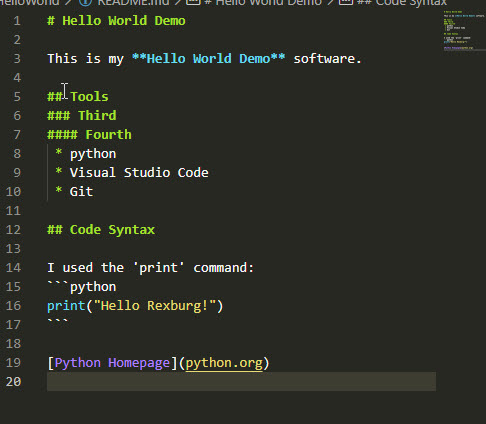

# Hello World Demo

This is my **Hello World Demo** software.

## Tools
### Third
#### Fourth
 * python
 * Visual Studio Code
 * Git

## Code Syntax

I used the 'print' command: 
```python
print("Hello Rexburg!")
```

[Python Homepage](python.org)

